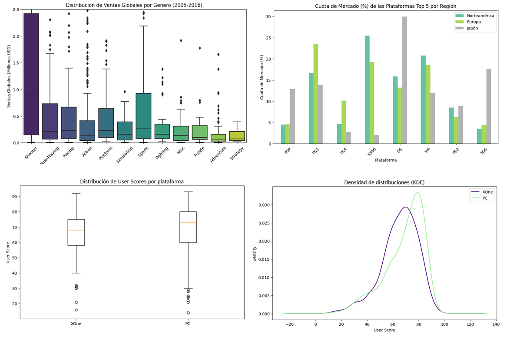

# 🎮 Análisis de Ventas de Videojuegos

## Descripción
Este proyecto tiene como objetivo analizar datos históricos de ventas de videojuegos para identificar patrones de éxito comercial. A través de análisis exploratorio de datos (EDA), visualización y pruebas de hipótesis, se busca entender qué factores influyen en el rendimiento de un videojuego en el mercado.

## Objetivo
Responder preguntas como:
- ¿Qué plataformas generan más ventas?
- ¿Qué géneros son más populares?
- ¿Las reseñas influyen en el éxito comercial?
- ¿Existen diferencias entre regiones?

## Tecnologías utilizadas
- Python  
- pandas  
- NumPy  
- matplotlib  
- seaborn  
- estadística inferencial  

## Dataset
Dataset con información de ventas globales de videojuegos, incluyendo:
- Plataforma  
- Género  
- Ventas por región (NA, EU, JP, Global)  
- Calificaciones de usuarios y críticos  

## Proceso de análisis
1. Limpieza de datos (valores nulos, formatos incorrectos).
2. Análisis exploratorio (EDA).
3. Visualización de distribuciones y comparaciones.
4. Formulación y validación de hipótesis estadísticas.
5. Interpretación de resultados.

## Resultados clave
- Las plataformas más exitosas concentran la mayoría de las ventas globales.
- Algunos géneros tienen mayor estabilidad comercial que otros.
- Las reseñas muestran correlación con el éxito, pero no son el único factor.
- Existen diferencias claras entre regiones de consumo.

## Conclusiones
El análisis permitió generar insights relevantes para estrategias de mercado, como:
- Identificar plataformas con mayor potencial.
- Detectar géneros con mejor retorno comercial.
- Apoyar decisiones de inversión y marketing basadas en datos.
