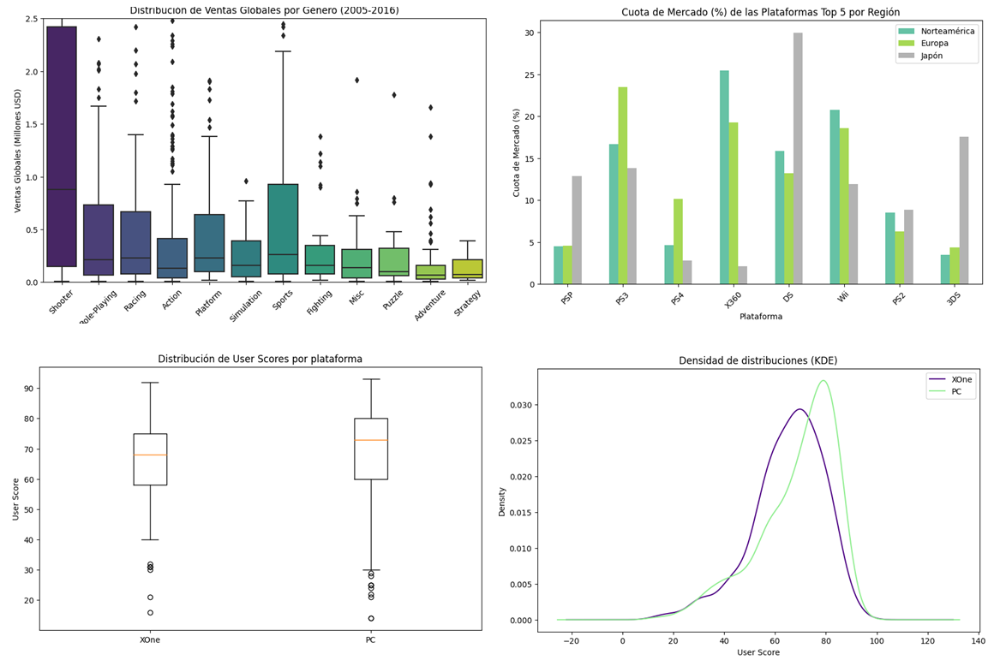

# 🎮 Video Game Sales Analysis

Data analysis case study focused on identifying the factors that influence video game sales performance across different platforms, genres, and global markets.

---

## 📌 Project Summary

This project analyzes historical video game sales data to uncover market trends and identify the factors associated with commercial success.

Through exploratory data analysis (EDA), visualization, and statistical hypothesis testing, the project provides insights into platform performance, genre popularity, regional preferences, and the relationship between reviews and sales.

---

## 🏆 Key Results

- Identified the best-performing gaming platforms across different time periods.
- Analyzed genre popularity and long-term market trends.
- Evaluated the relationship between critic/user reviews and sales.
- Revealed significant differences in consumer preferences across global regions.

---

## 💼 Business Problem

Video game publishers need reliable market insights to make informed decisions about product development, marketing strategies, and platform selection.

This analysis explores historical sales data to identify the characteristics of successful games and support data-driven business decisions.

---

## 📂 Dataset

The dataset contains historical information about video game sales, including:

- Platform
- Genre
- Release year
- Critic scores
- User scores
- Sales by region (North America, Europe, Japan)
- Global sales

The project involved data cleaning, preprocessing, exploratory analysis, visualization, and statistical testing.

---

## ⚙️ Technologies

- Python
- pandas
- NumPy
- Matplotlib
- Statistical Analysis

---

## 🔬 Project Workflow

- Data Cleaning
- Exploratory Data Analysis (EDA)
- Data Visualization
- Correlation Analysis
- Statistical Hypothesis Testing
- Business Interpretation

---

## 📊 Analysis Performed

The project investigates:

- Platform performance over time
- Genre popularity
- Sales distribution by region
- Relationship between reviews and sales
- Market trends
- Statistical validation of business hypotheses

---

## 📈 Findings

The analysis revealed that:

- A small number of platforms concentrate most global sales.
- Certain genres consistently outperform others.
- Review scores show a positive relationship with commercial success, although they are not the only determining factor.
- Consumer preferences vary significantly across North America, Europe, and Japan.

These insights provide valuable information for market strategy and investment decisions.

---

## 💡 Business Impact

The results can help gaming companies:

- Select promising platforms
- Identify high-performing genres
- Better understand regional markets
- Support marketing and product-launch decisions
- Reduce business risk through data-driven planning

---

## 📁 Repository Structure

```text
video-game-sales-analysis
│
├── video_game_sales_analysis.ipynb
├── videogames.png
└── README.md
```

---

## 👩‍💻 Author

**Paola Romero**

Data Analyst | Business Intelligence | Data Science

📁 Portfolio  
https://paolaromerop.github.io/paola-portafolio/

💼 LinkedIn  
https://www.linkedin.com/in/paolaromeroperez/

---

Developed as part of the TripleTen Data Science Bootcamp, applying exploratory data analysis, statistical testing, and business intelligence techniques to identify market trends in the video game industry.
